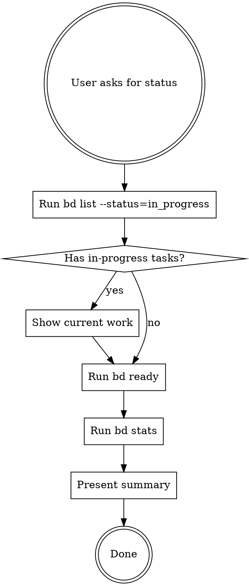

# Check Beads Status

## Overview

Provides structured workflow for checking Beads project status, showing current work, and recommending next steps.

## When to Use

Use this skill when:
- User asks "what am I working on?"
- User asks "what should I do next?"
- User asks "show me beads status"
- Starting a session and need to understand project state
- User wants to know available work

## Workflow



## Standard Output Format

### 1. Current Work Section
```markdown
## Current Work

[If in_progress tasks exist]
- **jigs-xxx**: [title] (IN_PROGRESS)
  - Status: [brief context from bd show]

[If no in_progress tasks]
No tasks currently in progress.
```

### 2. Available Work Section
```markdown
## Available Work ([N] ready)

**Highest Priority:**
- [P1] jigs-xxx: [title]

**Other Ready Tasks:**
- [P2] jigs-yyy: [title]
- [P2] jigs-zzz: [title]

[If no ready work]
No unblocked tasks available. Check bd blocked for blocked items.
```

### 3. Project Health Section
```markdown
## Project Health

- Open: [N] issues
- In Progress: [N]
- Blocked: [N]
- Ready: [N]

[If blocked > 0]
⚠️ [N] issues are blocked. Run `bd blocked` for details.
```

### 4. Recommendation Section
```markdown
## Recommendation

[If in_progress exists]
Continue working on [task-id]: [title]

[If no in_progress but ready tasks exist]
Start with [highest-priority-task]: [rationale]

[If no ready tasks]
Resolve blockers or create new issues. Run `bd blocked` to see what's blocking work.
```

## Required Commands

Run these in order:
1. `bd list --status=in_progress` - Find current work
2. `bd ready` - List available work
3. `bd stats` - Get project health
4. `bd show <id>` (optional) - Get details for specific tasks

## Common Mistakes

| Mistake | Fix |
|---------|-----|
| Skipping in_progress check | Always check in_progress FIRST |
| Not showing project health | Always run bd stats |
| Too verbose | Use structured format, not narrative |
| Recommending without context | Show WHY this task is recommended |
| Ignoring blocked tasks | Mention if blocked > 0 |

## Quick Reference

**Minimal response** (when user just wants to know current status):
```markdown
Currently working on: [task-id] or "None"
Ready to start: [N] tasks
Next: [recommendation]
```

**Full response** (when user wants detailed status):
Use all 4 sections (Current Work, Available Work, Project Health, Recommendation)

## Real-World Impact

- **Consistency:** Every status check follows same format
- **Context:** Always shows current work before suggesting next steps
- **Efficiency:** User knows exactly where they are and what's next
- **Visibility:** Project health section surfaces blocked work early
